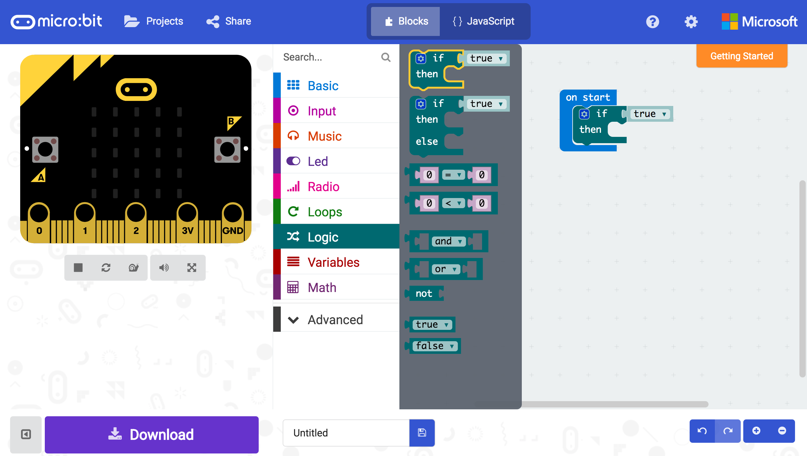
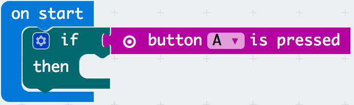

# Activity Worksheet: Switch Statements

## Introduction
In this project activity you will learn to create switch statements and create logical decisions with your code to produce different outputs dependant on the inputs pushed through the micro:bit. This will build upon your previous skills you have learnt from the Inputs & Ouputs and Variables project activities.

## Part 1: Switch Statement Basics
Lets begin the activity by trying out some simple switch statement blocks:

- [ ] Open up a browser and go to **[https://makecode.microbit.org](https://makecode.microbit.org)**.
- [ ] Start a new empty project by clicking on the **projects menu** and select the **New Project** menu button in the pop-up screen, this only needs to be done if there is still old code on the sandbox from your previous work.

- [ ] In the block menu click the **logic menu**, drag the **if then** block and place it within the **on start** block.

- [ ] In the block meny click the **input menu**, drag the **button A is pressed** field and place it next to the if holder.  

## Part 2: The Basics Continued

## The Challenge
Try out this challenge exercise with less help, by

## Think Like a Robot Puzzle
Can you think like a robot to solve the puzzle below?