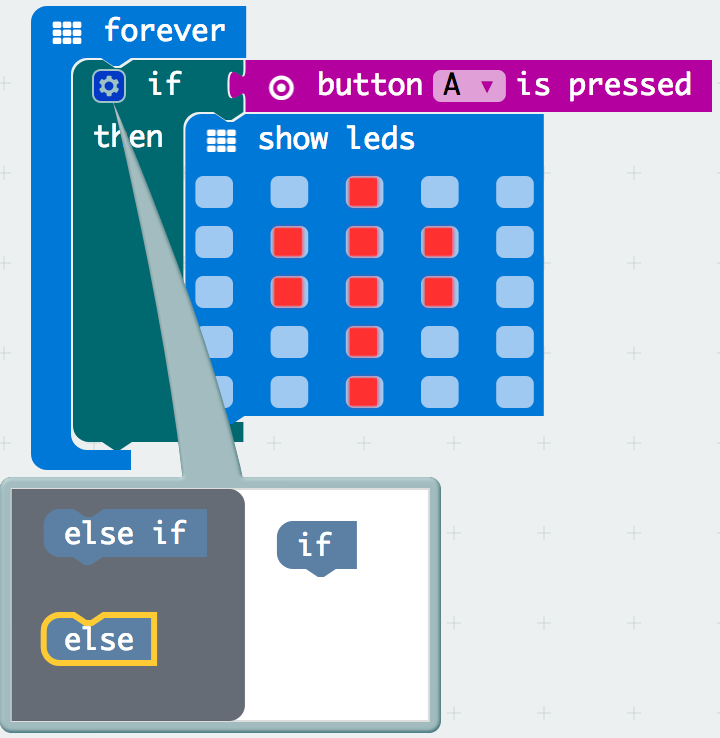
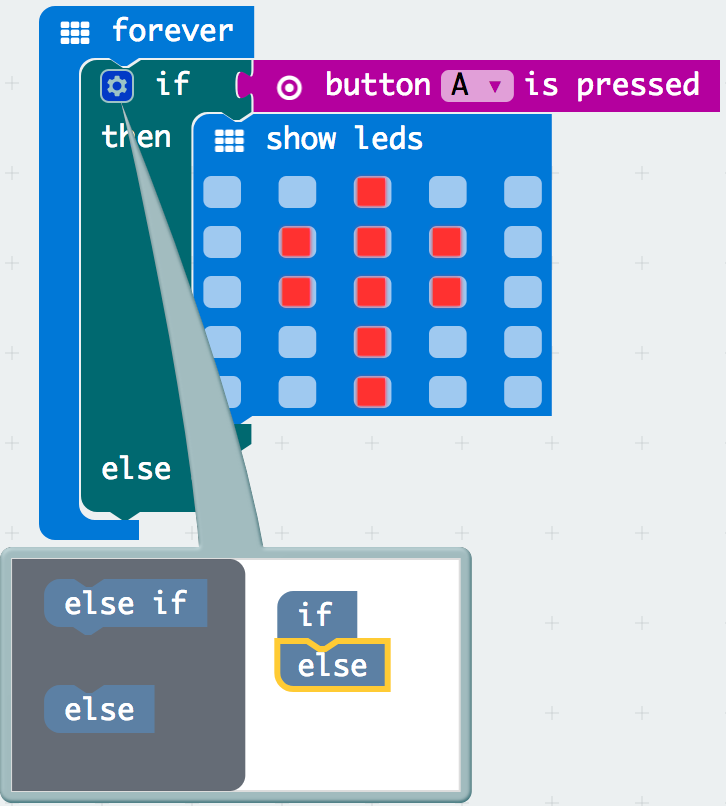

# Activity Worksheet: Switch Statements

## Introduction
In this project activity you will learn to create switch statements and create logical decisions with your code to produce different outputs dependant on the inputs pushed through the micro:bit. This will build upon your previous skills you have learnt from the Inputs & Ouputs and Variables project activities.

## Part 1: Switch Statement Basics
Lets begin the activity by trying out some simple switch statement blocks:

- [ ] Open up a browser and go to **[https://makecode.microbit.org](https://makecode.microbit.org)**.
- [ ] Start a new empty project by clicking on the **projects menu** and select the **New Project** menu button in the pop-up screen, this only needs to be done if there is still old code on the sandbox from your previous work.

    

- [ ] In the block menu click the **logic menu**, drag the **if then** block and place it within the **on start** block.

    

- [ ] In the block menu click the **input menu**, drag the **button A is pressed** field block and place it next to the if holder.  

    

- [ ] In the block menu click the **basic menu**, drag the **show led** block and place it within the **if then** block with your designed image. Now test out the output by clicking the A button on the micro:bit and see what happens?

    

You are right if you said nothing happens, why? The **on start** block only runs your code once when it is executed so we need something that will run forever.
  

- [ ] In the block menu click the **basic menu**, drag the **forever** block and drag the **if else** placing it under the **forever** block. Try again and click the A button on the micro:bit.

    

Did you notice what happened after you clicked the A button on the micro:bit? An output of your image you created on the **show led** block appears once on the micro:bit.

## Part 2: If Then Else What?
We have learnt creating a simple switch statement block using the **forever** block instead of the **on start** block. Lets try expanding on what we learnt with the switch statements basic and add some more complexity to our code:

- [ ] Click on the settings cog button in the **if else** block.

    

- [ ] Drag the **else** block and place it under the **if** block within the pop-up.

    

Did you notice what happened? It has expanded your **if then** block to add an esle part, you have created a cross road. If button A is pressed do one thing, if it is not pressed to the other hence the keyword else.

    

  

- [ ] Lets add a new **show leds** block and drag it in the **if else** block, you should now have two **show leds** blocks.

    

## Part 3: If Then Else Then Else Then Else Then... again?

## Part 4: The Basics Continued

## The Challenge
Try out this challenge exercise with less help, by

## Think Like a Robot Puzzle
Can you think like a robot to solve the puzzle below?