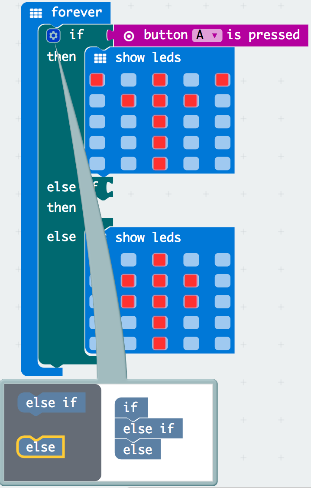
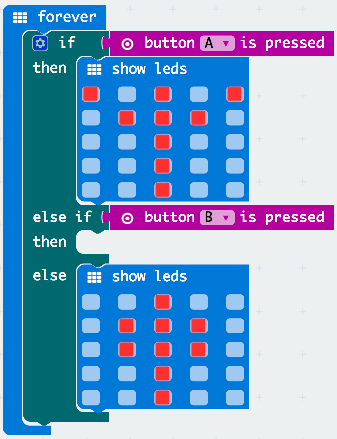
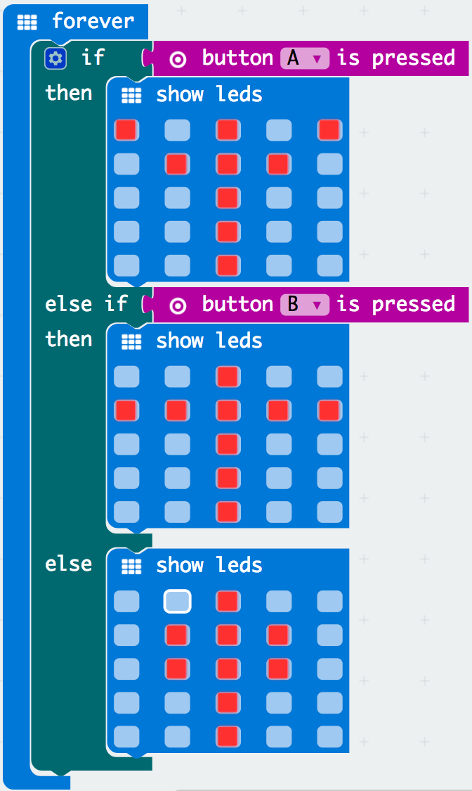
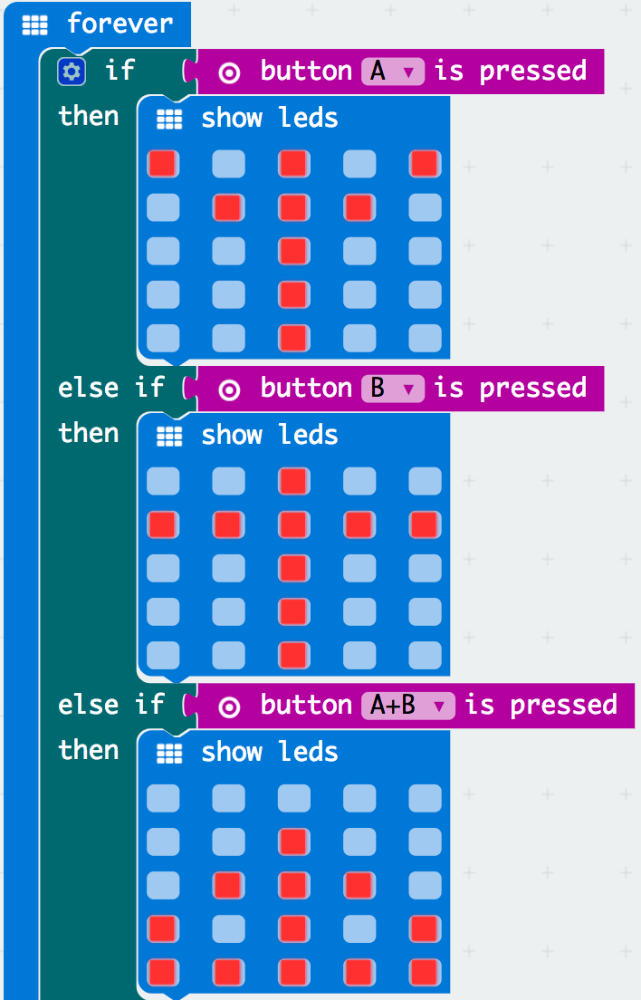
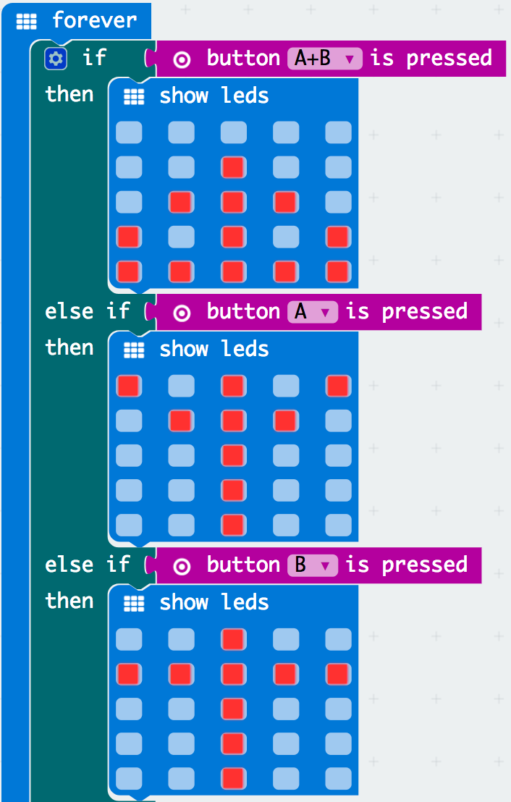
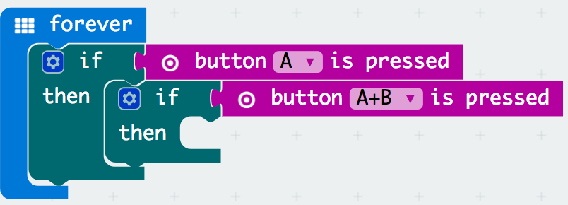
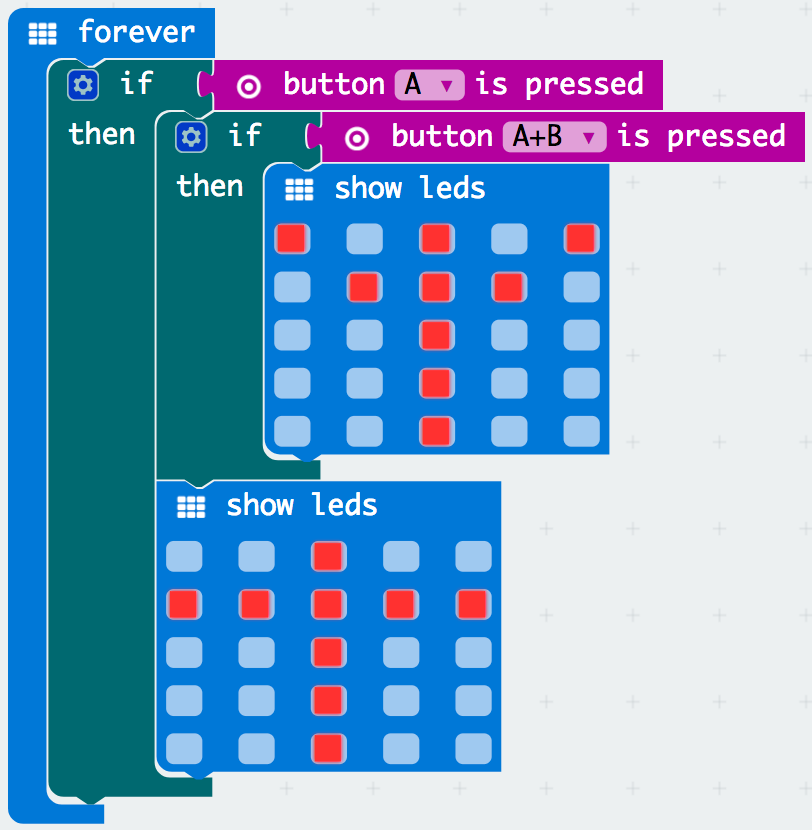
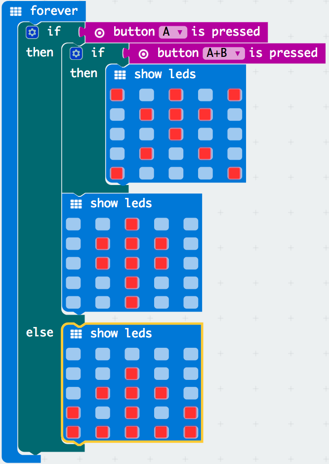

# Activity Worksheet: Switch Statements

## Introduction
In this project activity you will learn to create switch statements and create logical decisions with your code to produce different outputs dependant on the inputs pushed through the micro:bit. This will build upon your previous skills you have learnt from the Inputs & Ouputs and Variables project activities.

## Part 1: Switch Statement Basics
Lets begin the activity by trying out some simple switch statement blocks:

- [ ] Open up a browser and go to **[https://makecode.microbit.org](https://makecode.microbit.org)**.
- [ ] Start a new empty project by clicking on the **projects menu** and select the **New Project** menu button in the pop-up screen, this only needs to be done if there is still old code on the sandbox from your previous work.

    

- [ ] In the block menu click the **logic menu**, drag the **if then** block and place it within the **on start** block.

    

- [ ] In the block menu click the **input menu**, drag the **button A is pressed** field block and place it next to the if holder.  

    

- [ ] In the block menu click the **basic menu**, drag the **show led** block and place it within the **if then** block with your designed image. Now test out the output by clicking the A button on the micro:bit and see what happens?

    

You are right if you said nothing happens, why? The **on start** block only runs your code once when it is executed so we need something that will run forever.
 

- [ ] In the block menu click the **basic menu**, drag the **forever** block and drag the **if else** placing it under the **forever** block. Try again and click the A button on the micro:bit.

    

Did you notice what happened after you clicked the A button on the micro:bit? An output of your image you created on the **show led** block appears once on the micro:bit.

## Part 2: If Then Else What?
We have learnt creating a simple switch statement block using the **forever** block instead of the **on start** block. Lets try expanding on what we learnt with the switch statements basic and add some more complexity to our code:

- [ ] Click on the settings cog button in the **if else** block.

    

- [ ] Drag the **else** block and place it under the **if** block within the pop-up.

    

Did you notice what happened? It has expanded your **if then** block to add an esle part, you have created a cross road. If button A is pressed do one thing, if it is not pressed - do the other hence the keyword else.

    

- [ ] Lets add a new **show leds** block and drag it in the **if else** block, you should now have two **show leds** blocks.

    

Test out your code and see what the output is, the standing person appears now in the micro:bit with no inputs and when you hold the A button on the micro:bit the standing person changes to having their hands up in the air.
 

- [ ] Click on the settings cog wheel and remove the **else** block.

    

- [ ] Test out your code on the micro:bit, what do you notice?

    

When you press the A button, the standing person appears with hands up in the air but does not return back to its original position. Why? Because you removed the else block, which means only when the A button is pressed you will see the action and it will not return back to its original position.

## Part 3: If Then Else Then Else Then Else Then... again?
We have learnt to create a switch statement block using an if & else statement with two show leds output blocks with a simple input condition. Lets try and expand what we learnt and create a switch statements with multiple different conditions:

- [ ] Click on the settings cog button in the **if else** block and add another **else if** block to add a new condition.

    

- [ ] In the block menu click the **input menu**, drag the **button A is pressed** block and place it in the second else if connector.

    

- [ ] Add a new **show leds** block to your new else if block. Test out your code on the micro:bit by holding the A button and then the B button, what do you notice?

    

We have created three different ouputs from three different inputs: if no button is pressed standing person, if the A button is pressed hands up in the air and if the B button is pressed hadns on their side.
 

- [ ] Lets try expand the switch statement block by adding another **else if** block within the switch statement, and dragging the **button A+B is pressed** to the connected with a new **show led** block. Lets test this out and what do we notice when you hold both the A+B button?

    

Did you notice only the output for the A button is presented when both A+B buttons are pressed, can you try and guess why?

Think of the switch statement as a waterfall falling from top to bottom, if an input meets the condition it will run the output from that block. In this case even though both **A+B buttons** are pressed, it will stop on the frist condition as the computer understands that the **A button** is pressed, even though the **B button** is aslo. How do we try and resolve this?
 

- [ ] Drag the **button A+B is pressed** block with the ouput block and set it as the first condition of the switch statement. Retest your new code and what is the result?

    

This time the ouput works when you hold the **A+B Button** on the micro:bit to produce a stick person sitting on the ground, similar to when you press the **A Button** and **B Button** the respected outputs appear on the micro:bit.

## Part 4: An If Then Else within an If Then Else
We tried to create multiple different switch statements with different inputs to produce different ouputs called conditions. Lets try to understand how we can add a switch statement within a switch statement:

- [ ] In the block menu click the **logic menu** and drag two **if then** blocks within the **forever** block.

    

- [ ] In the block menu click the **input menu**, drag two new **button A is pressed** and **button B is pressed** blocks and place it in the **if else** block connectors.

    

- [ ] In the block menu click the **basic menu**, drag two new **show leds** block and place it each under the seperate **if else** blocks.

    

Did you notice when you hold the A+B button, the standing person lifts up their arms up and drops it down horizontally. This is because we have added two blocks within the **if else** block, so it executes one after the other.
 

- [ ] From what you have learnt, expand the **if else** block to add the else condition with a new **show leds** block. Change the actions of the **show leds** block and test out your new code by holding the **A button** and then the **A+B Button**.

    

While testing what did you notice? When you hold the **A+B Button** you have simplified building the animation of the jumping stick person with only 6 blocks. 

## The Challenge
Try out this challenge exercise with less help, by

## Think Like a Robot Puzzle
Can you think like a robot to solve the puzzle below?