# Activity Worksheet: Loops

## Introduction
In this project activity you will learn to create loops with different inputs (conditions) to produce different outputs with the micro:bit. This will build upon your pervious skills you have learnt from the previous project activites.

## Part 1: Basics Loops
Lets begin the activity by trying out some simple conditional statement blocks:

- [ ] Open up a browser and go to **[https://makecode.microbit.org](https://makecode.microbit.org)**.
- [ ] Start a new empty project by clicking on the **projects menu** and select the **New Project** menu button in the pop-up screen, this only needs to be done if there is still old code on the sandbox from your previous work.

    

- [ ] In the block menu click the **loops menu**, drag the **repeat** block and place it within the **on start** block.

    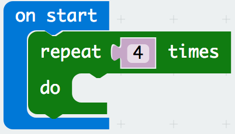

- [ ] In the block menu click the **basic menu**, drag the **show leds** block and place it within the **repeat** block and draw out a stick person standing up.

    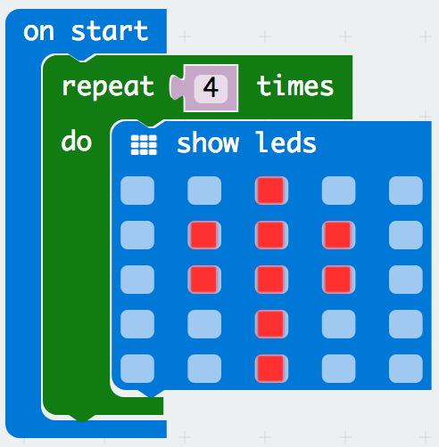

- [ ] In the block menu click the **basic menu**, drag another the **show leds** block and place it within the **repeat** block and draw out a stick person jumping. What did you notice?

    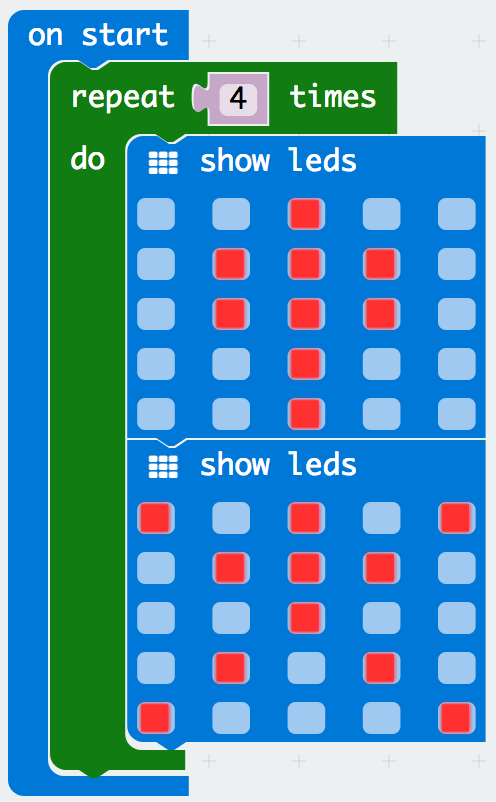

The stick person jumped up and down four times because the **repeat** block repeats 4 times. 

- [ ] Change the number 4 in the **repeat** block to a 6, what do you notice?

    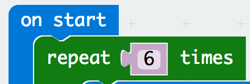

The stick person jumped up and down 6 times.

- [ ] In the block menu click the **math menu**, drag the **0 + 0** block and place on the repeat block, change your math block to **2 + 2**. We can add two numbers together using the **maths block** to create an output using additions, subtractions, multiplication and division.

    

- [ ] Delete the **2 + 2** block and add a variable from in the blocks menu click the **variables menu** , drag the **set item to 0** block and place it under the **on start** block.

- [ ] Change the **set item to 0** variable name to **index** and change the number to 10.

    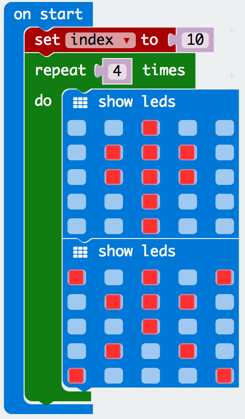

- [ ] In the block menu click the **variable menu**, drag the **index** variable and place it in the repeat block. We have now created a variable that can be used in the **repeat** block loop.

    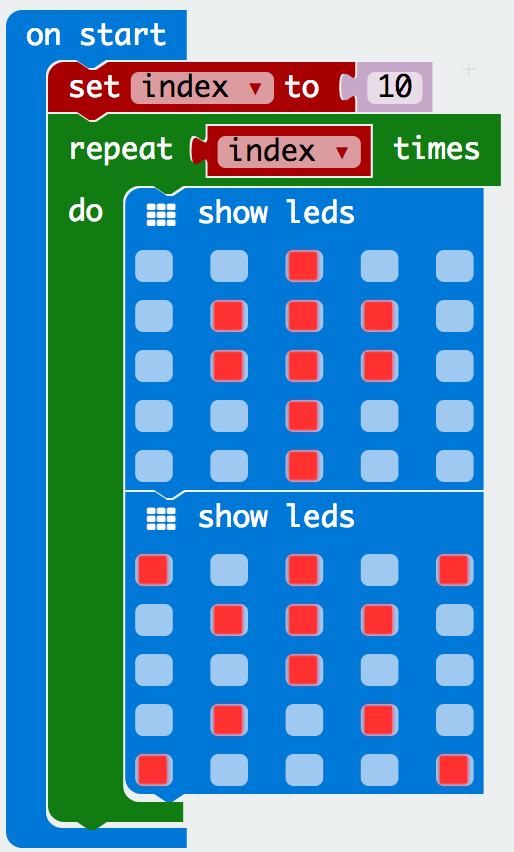

Did you notice from the last activity we used the **forever** block to make our code repeat, this time we made a loop in the **on start** block todo the same thing. We have more control with creating loops as we can only create certain code to loop and the rest of the code can only run once.

## Part 2: While Loops
We have learnt in creating a simple loop block using the **repeat** block. Lets try expanding on what we learn with the while loop and add get an understanding of a boolean:

- [ ] Lets start afresh and delete all the code within the **on start** block. In the block menu click the **loop menu**, drag the **while** block and place it within the **on start** block.

    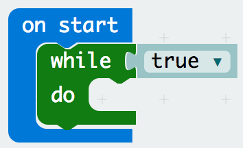

- [ ] In the block menu click the **basic menu**, drag the **show leds** block and place it within the **while** block and draw out a stick person standing up.

    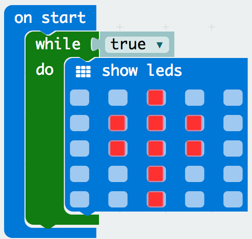

- [ ] In the block menu click the **basic menu**, drag another the **show leds** block and place it within the **while** block and draw out a stick person jumping. What do you notice?

    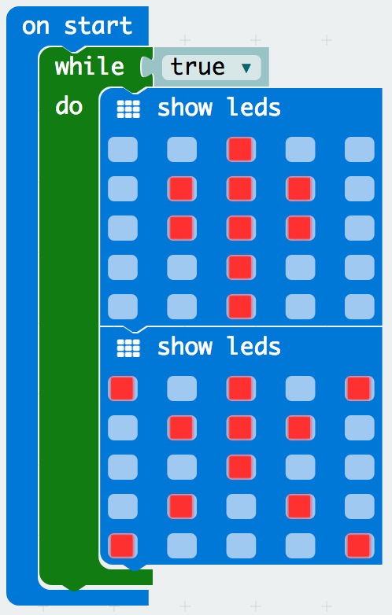

If you said the stick person does not stop jumping you are right, a **while** loop is a loop that only runs (executes) when its true otherwise it will not run if its false. 

- [ ] In the **while** loop set the condition drop down from true to false. Did you notice it stop? It no longer runs the loop.

    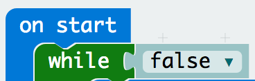

- [ ] Lets return the **while** loop condition back to true. What did we notice?

    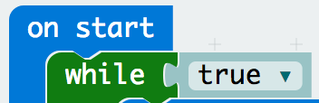

If you said the stick person does not stop jumping, you are right - how would we fix this? We need to control the while loop to stop.

## Part 3: Controlling While Loops
We learnt we can control **repeat** loops but putting in the maximum number of repeats we want, how do we do that with a while loop?

- [ ] Lets start afresh and delete all the code within the **on start** block. In the block menu click the **variable menu**, drag the **set item to 0** block and place it within the **on start** block.

    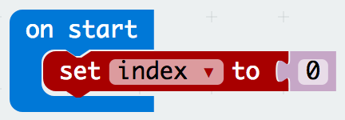

- [ ] Change the name of the **variable** block and call it index.

- [ ] In the block menu click the **loop menu**, drag the **while** block and place it within the **on start** block.

    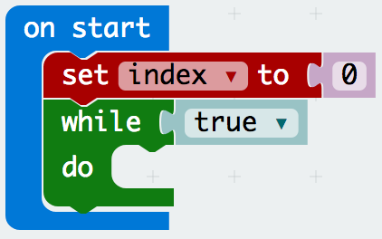

- [ ] Lets add a condition, in the block menu click the **logic menu**, drag the **0 = 0** block and place it within the **while** block.

    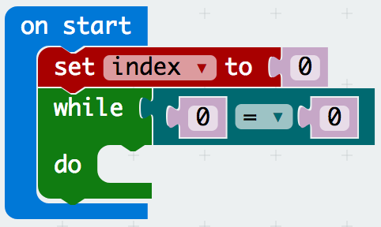

- [ ] In the block menu click the **variables menu**, drag the **index** variable block and add it in the **while** loop block condition. 

    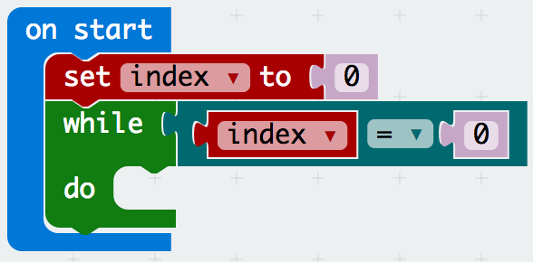

- [ ] In the block menu click the **basic menu**, drag the **show leds** block and place it within the **while** block and draw out a stick person standing up.

    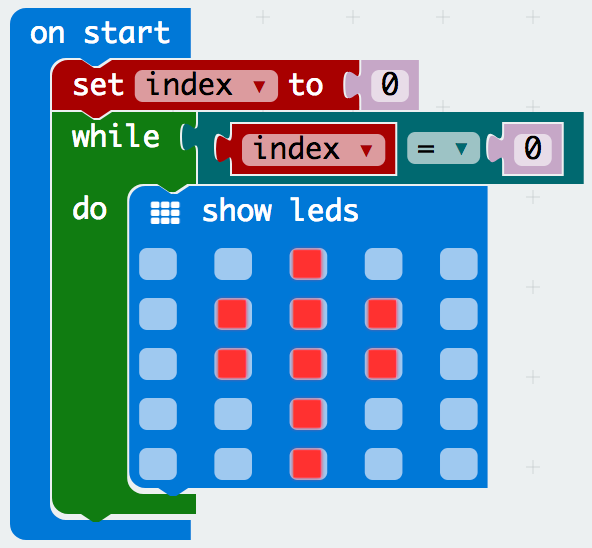

- [ ] In the block menu click the **basic menu**, drag another the **show leds** block and place it within the **while** block and draw out a stick person jumping. What did you notice?

    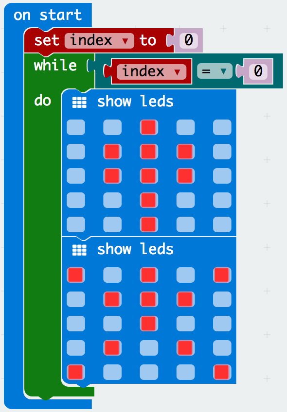

- [ ] Lets add an **if esle** block in the **logic menu**, drag the **if else** block and add it in the **while** loop.

    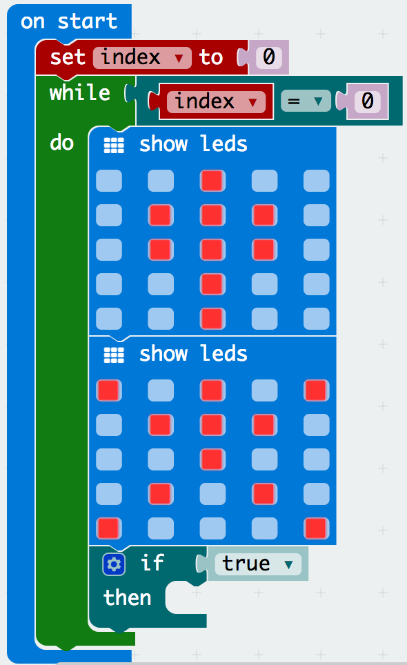

- [ ] In the block menu click the **variables menu**, drag the **set index** variable block and add it in the **if** block condition. Change the variable number to 1. 

    

- [ ] In the block menu click the **input menu**, drag the **button A is pressed** and place it in the **if else** block condition.

    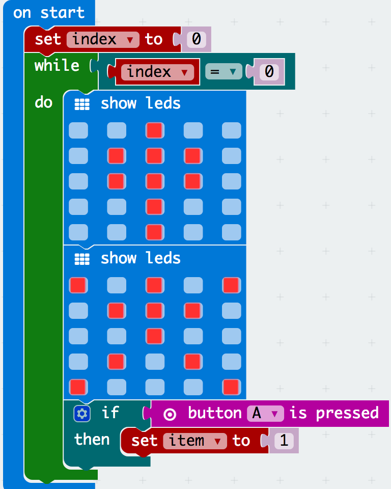

- [ ] In the block menu click the **basic menu**, drag the **show leds** block and place it outside the **while** block and draw out a stick person standing up. Hold the **A button**, what do you notice?

    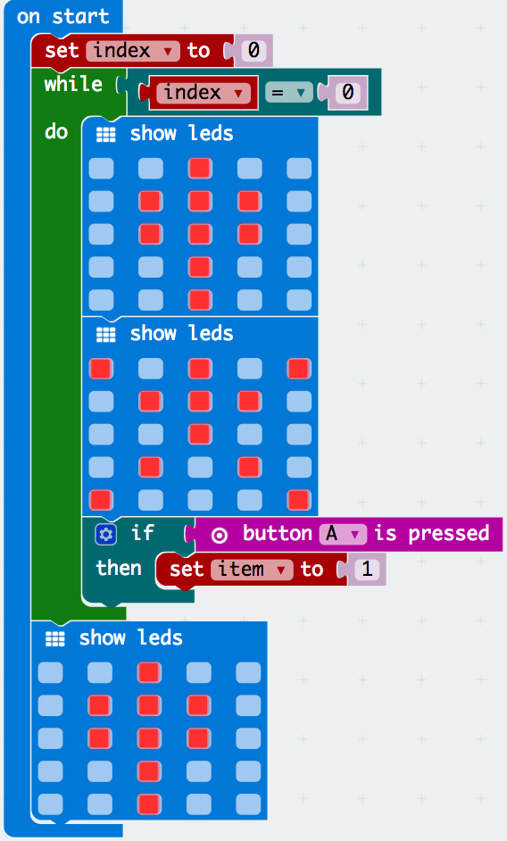

You are right, the code stops. Can you see what has happened? When the **A button** is pressed it changes the variables to 1, which means the while loop no longer is true as 1 does not equal 0. We have learnt how to create a condition in a while loop, you have tried your first complex code.

## The Challenge
Try out this challenge exercise with less help, by creating a bouncing ball when:
