# Activity Worksheet: Loops

## Introduction
In this project activity you will learn to create and access lists with the micro:bit. This will build upon your pervious skills you have learnt from the previous project activites such as variables, loops and conditional statements.

## Part 1: Basics Lists
Lets begin the activity by trying out some simple items in a list like we did in the starter exercise.

- [ ] Open up a browser and go to **[https://makecode.microbit.org](https://makecode.microbit.org)**.
- [ ] Start a new empty project by clicking on the **projects menu** and select the **New Project** menu button in the pop-up screen, this only needs to be done if there is still old code on the sandbox from your previous work.

    

- [ ] In the block menu click the **Arrays menu**, drag the **list set value at** block and place it within the **on start** block.

    

- [ ] On the same **on start** block now add another item to the list. We are building the list. We can add as many items as we want to the list. 

    

You might notice that the code looks a little different to yours. That is because the first number in the code line has changed. That is the **index** for the other number. This is what we use to call the other numbers when we want them. You should change your **index** and value for each item with the variables in the **Maths** block menu.

- [ ] Lets add some more items to our list. Go to the **Array** menu in the block menu and repeat the steps above. Remember to change the index and the value with the variables from the **Maths** menu so they match.

    

## Part 2: Output from the List

Now we've got a list we can work with. We're going to access the list now and show some of the numbers with an output on the microbit. Do you remember how to use inputs and outputs on the microbit? 

- [ ] Try find the output for **show number**.

The show number output is in the **Basic** menu in the block menu.

    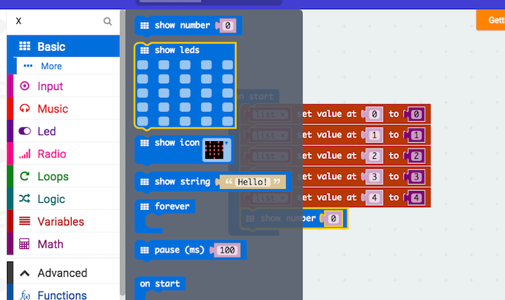

Once you've dragged that out into the **on start** block above, the next step is to change what it shows to show an item from the list. To do that, we need to go back to the **Arrays** menu to access the list. In there we want to get the **list get value at** option and drag it into the show number block. 

    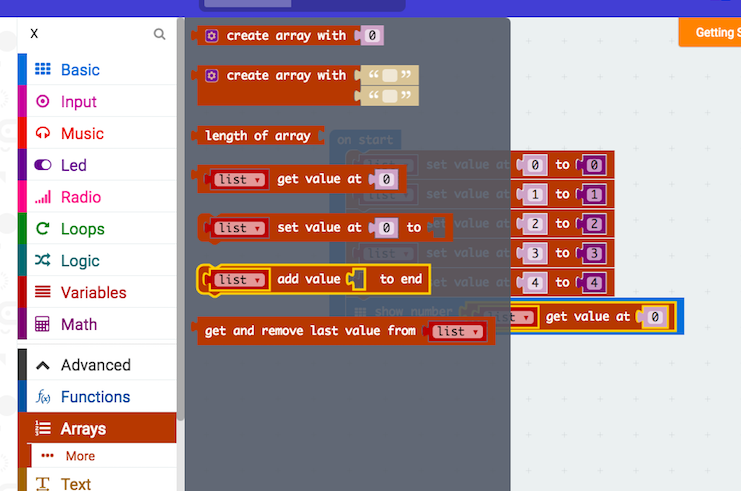

    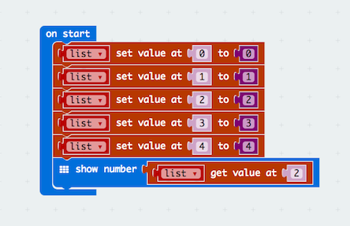

Does the microbit show you the item from the list? Have a look at the **index** you're using - thats the number after **get value at**. That means you're telling the microbit to get the item at that index. 

- [ ] Change the **index** to see what happens. Change it to 1 and then to 3. The microbit should get the item in the list wherever you tell it to look. This will be more useful when the list is mixed up. 

## Part 3: Adding to the List

Now we're going to add to the list. For that, we need to go to the **Arrays** menu again. Go to the **Arrays** menu and drag out the option to **list add value to end**.

    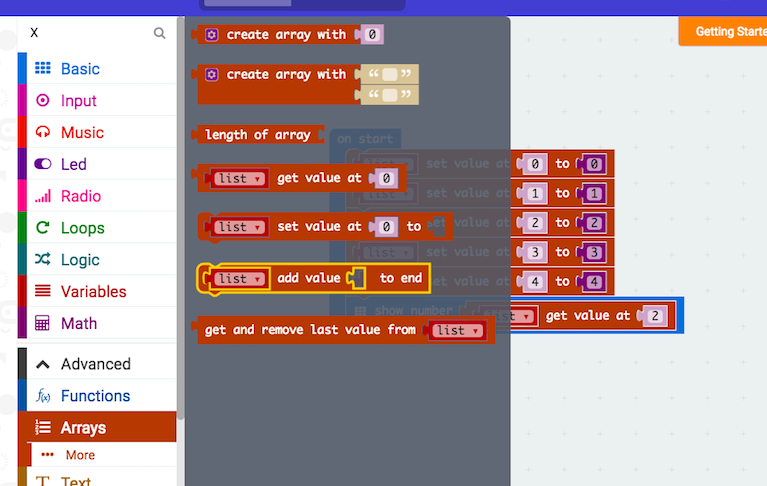

    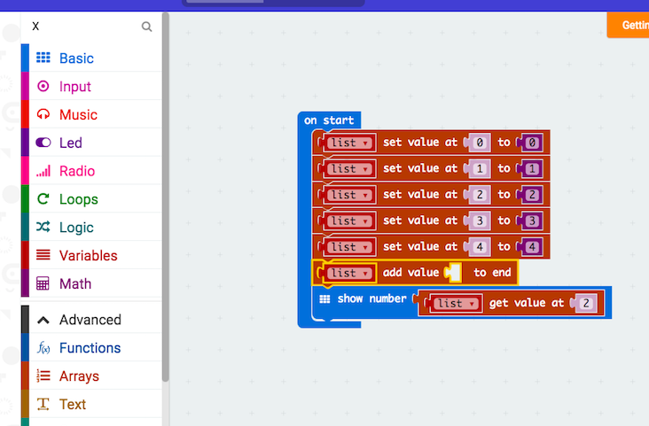

    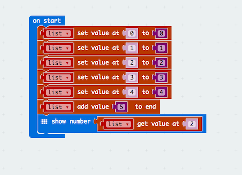

That should have added an item to the end of the list. Since it's at the end, it should have an index after the last index. 

If the last index was 4, what would the new last index be? We can use the **show number** output we added earlier and the **list get value at** option to see what is at each index. Let's look for the one we just added. 

- [ ] Change the **index** you're looking for to 5 to check that we added another item to the list. 

    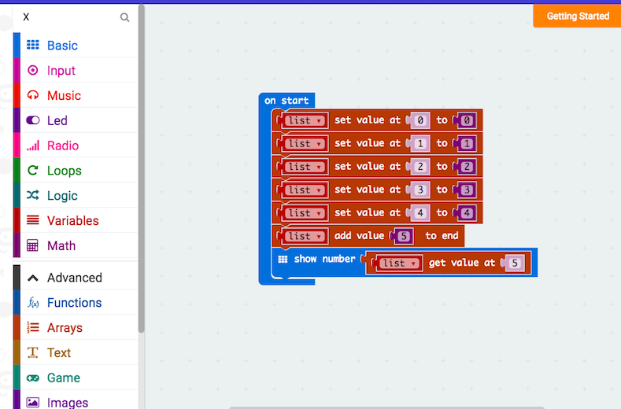

Did it work? 

That should show that we've added an item to the end of the list. 

## Part 4: Loops in the list

Last week we looked at loops. This is where the code repeats an action over and over. We could make a loop that repeats while something is true. We could also make a loop that repeated a number of times. 

We're going to make a loop that repeats an action for every item in the list now. To start, lets get the correct for loop from the **loop** menu.

- [ ] Go to the **Loop** menu in the block menu and drag out the bottom one - **for element value of list** - and put it before the show number option we already have in there.

    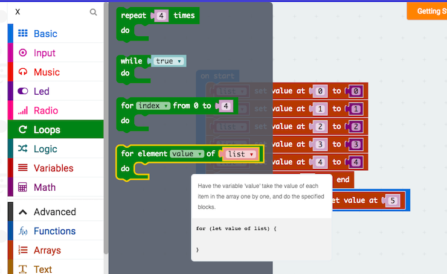

Next we're going to put the **show number** option into the loop so it can be repeated for each item.

- [ ] Drag the **show number** option from below the loop, up into the loop.

    

    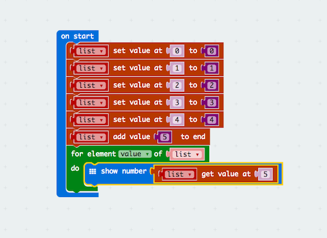

This loop wont work quite yet. We need to change the **show number** option so that it does something different each time the loop is repeated. We're going to make it show the number each time the list repeats. So for the first loop it should show 0, then on the second loop 1, then on the third 2... 

- [ ] Have a look at the code and think about what we might change

The **for element value of list** loop is telling the microbit to do something for all the **values** in the **list**. These values are the indexes. So we want the **show number** to show that value. 

- [ ] Get the **value** variable from the **Variable** menu on the block menu and drag it out into the end of the **show number list get value at** option

    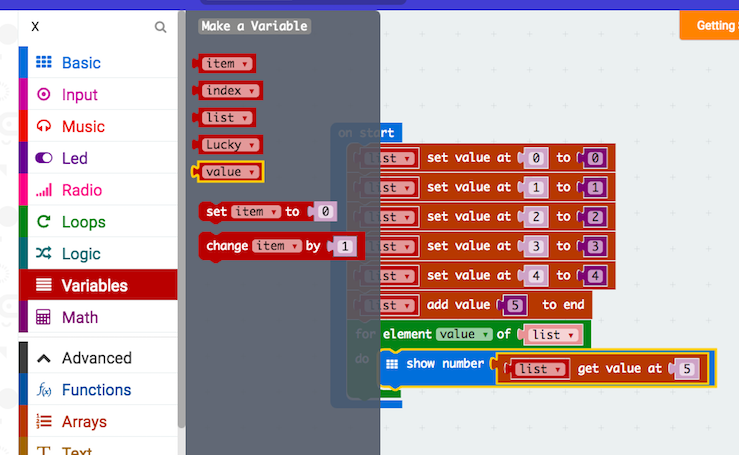

    

Well done. Now we have a **list** that is being used in the **loop** and outputting the item in the list. 

## Part 5: Using a variable in the list

In the final two parts of the lesson we're going to create a variable and call it 'Lucky'. This is going to be our favourite number between 0 and 5. Then we're going to look for it in the list and ask the microbit to tell us what index it is at. 

To do this, the microbit is going to check each index to see if it has our lucky number as the value, and it will only tell us when it's correct.

- [ ] Go to the **Variables** menu in the block menu and drag out the **set item to** option. Put it at the top of the code.

This will create a variable

    

Next we're going to change the name of the variable. Click **item** in that option and then select *Rename variable*.

    

In the box that comes up, enter the work 'Lucky' and click 'okay'.

Now your code should look like this.

    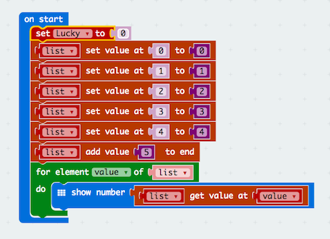

Now pick your lucky number between 0 and 5.

- [ ] Click the number after the new **Lucky** variable and enter your own number.

    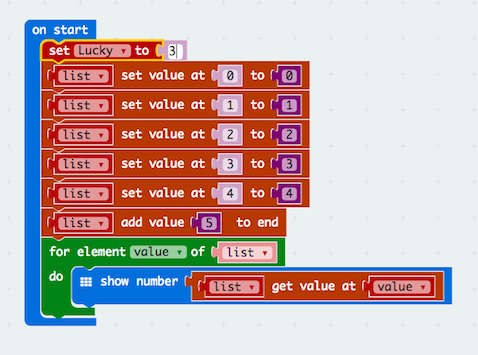

One more step to go.

## Part 6: Conditional Statements 

You might remember **conditional statements** as **if statements**. These are tests you put in the code to check for certain things. You can check any variable or any sum or maths problem and have the microbit do something when the answer is true. Here, we're going to use the **conditional statement** to check if the item in the list is equal to our Lucky number.

- [ ] Go to the **Logic** menu in the block menu and drag out the top one that says **if true then** and place it in the **for loop** like the images below show.

    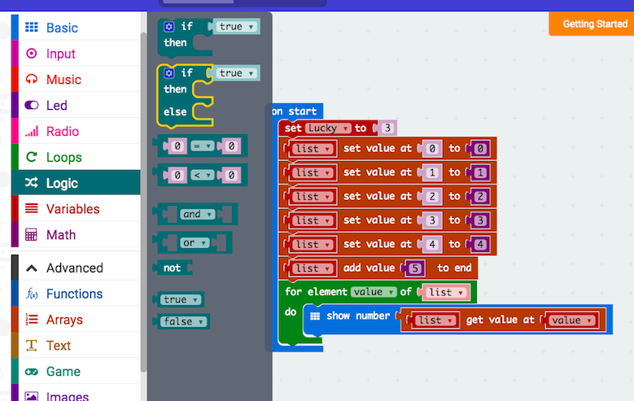

    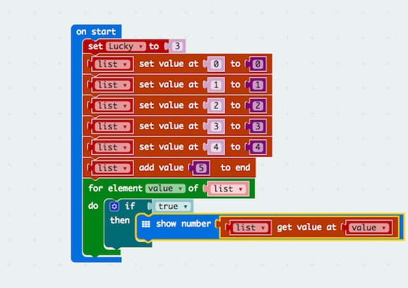

Now we need to build the conditional statement so it checks the items in the list. To do this, we need a test. This is in the **logic** menu. We're going to take the **0 = 0** test and then change it.

- [ ] Drag the **0 = 0** option out from the logic menu and insert it into the **if true then** statement where ther **true** is now.

    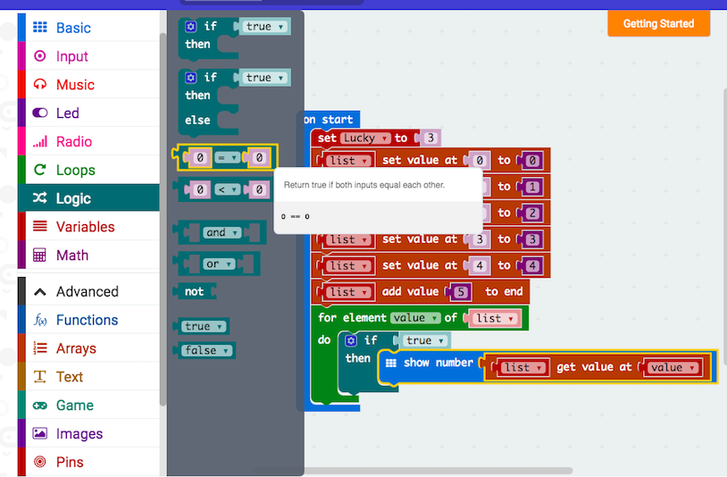

    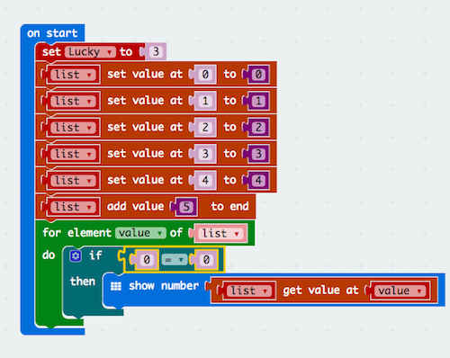

Instead of testing if **0 = 0** we want to test if **value = lucky**. That is, we want to test if the item in the list is the same as our luck number. To do this, we need to change the variables that are being compared. Can you think of how we might do that?

- [ ] Go to the **variables** menu in the block menu and drag out the **value** and **Lucky** variables into the conditional statement.

    

    

So in this code, we are looping around the list looking for items that are equal to the lucky number. 

To show how this might be useful, change the order of your list like in the picture above. So leave the first numbers in order, but change the second number for each item. Now with a little change to our code we can have the loop tell us where the lucky number is.

- [ ] Go to the **Arrays** menu in the block menu and then go to **More** below that. Drag out the **list find index of** option and put it in the **show number** option. 

    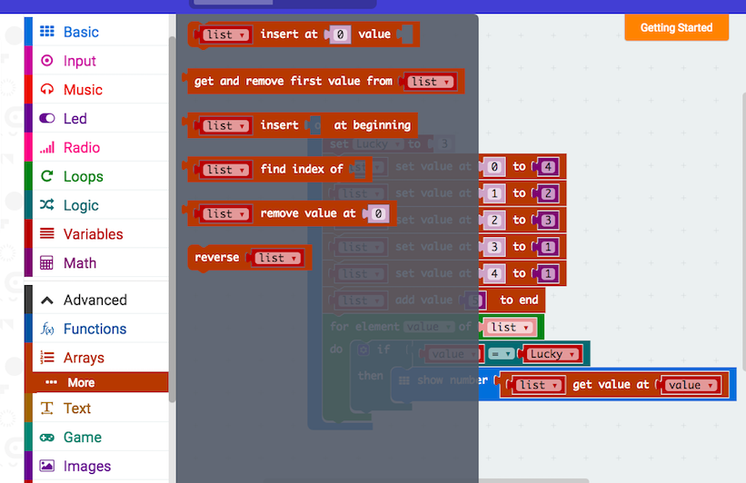

Now to make this show the index when the item is equal to the lucky number, we need to use the **value** variable.

- [ ] Go to the **Variables** menu in the block menu and drag out the **value** variable and put it in the end of the **show number list find index of**

    

Well done. You've completed the lesson.

You've created a **list** with a set of numbers.

You've created a **variable** and set it to your lucky number.

You've created a **conditional statement** to check if the items in the list are the same as the luck number.

And you've created a **loop** to check for all the number so you only need to set it off once.

# Challenge

For the challenge we'd like you to start again and create a new list with 10 numbers in it. Have the index numbers from 0 - 9. Have the list values any number you like from 1 - 100. 

Create 2 new variables called 'Min' and 'Max' and set them to 40 and 60.

Now use **loops** and **conditional statements** to check whether the numbers in the list are between those mininimum and maximum values.

Have the microbit read out the numbers first. Then change the code so that it tells you the index for the numbers. 
